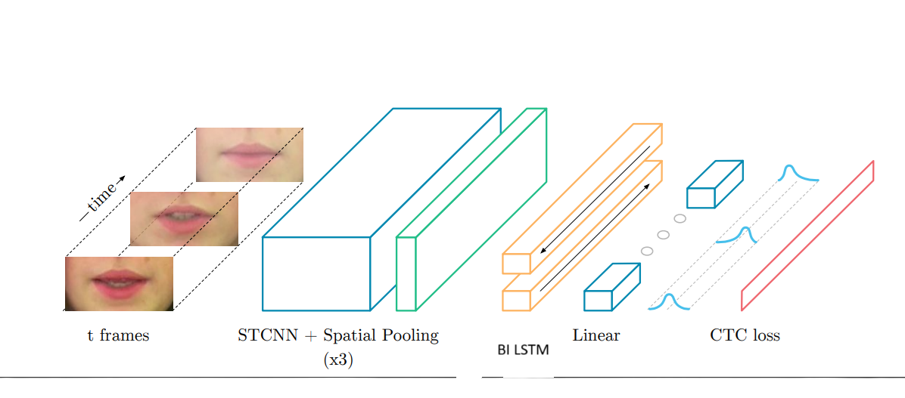

# LipNet Implementation

A custom implementation of the research paper "LipNet: End-to-End Sentence-level Lipreading" with PyTorch, constructed without using high-level APIs.

## Overview

This repository contains a reproduction of the LipNet architecture as described in the original research paper [LipNet: End-to-End Sentence-level Lipreading](https://arxiv.org/abs/1611.01599) by Yannis M. Assael, Brendan Shillingford, Shimon Whiteson, and Nando de Freitas. The model has approximately 20M parameters, comparable to the original implementation, and uses a combination of 3D convolutional neural networks and a custom LSTM implementation to recognize spoken words from video frames of lip movements.



*Architecture diagram will be added here*

## Research Implementation

This project faithfully reproduces the architecture described in the paper while implementing the LSTM components from scratch. Key aspects of the original research that have been maintained:

- End-to-end trainable neural network
- Spatiotemporal convolutions for visual feature extraction
- Bidirectional recurrence for sequential modeling
- CTC loss for sequence prediction without explicit alignment

## Model Architecture

The architecture consists of:

- **3D Convolutional Layers**: Three Conv3D layers with batch normalization, ReLU activation, and max pooling to extract spatial-temporal features from video frames, as specified in the paper.
- **Custom Bidirectional LSTM**: Implemented from scratch without using PyTorch's built-in RNN modules.
  - Forward and backward passes through the sequence
  - Manually implemented LSTM gates (forget, input, candidate, output)
  - Cell state and hidden state management
- **Classifier**: Linear layer to map to vocabulary output with softmax activation

## Dataset

The model is trained on a dataset of lip-reading videos and corresponding text alignments, following the methodology described in the paper:
- Videos are preprocessed to extract RGB frames
- Text alignments are converted to numeric indices using a custom vocabulary mapping
- Custom dataset class handles loading and preprocessing of data

## Training Process

- Uses CTC (Connectionist Temporal Classification) loss for sequence prediction, as in the original paper
- Adam optimizer with learning rate scheduling
- Gradient accumulation for effective batch processing
- Memory management techniques for large model training

## Requirements

- PyTorch
- OpenCV
- NumPy

## Directory Structure

```
├── datasets/
│   ├── videos/       # Video files organized by speaker
│   └── alignments/   # Text alignment files
├── main.py           # Main training script
└── README.md         # Project documentation
```

## Usage

1. Prepare your dataset in the required format
2. Configure paths in `main.py`
3. Run training:
```bash
python main.py
```

## Implementation Details

This implementation avoids high-level PyTorch APIs for RNN components, instead building them from scratch using basic tensor operations. Key features:

- Custom LSTM cell implementation following the paper's specifications
- Bidirectional sequence processing as described in the research
- Memory-efficient training with gradient accumulation
- Robust error handling to prevent NaN values during training

## Results

The model checkpoints are saved after each epoch, allowing for evaluation of training progress and eventual inference on new lip-reading videos. The performance metrics aim to match those reported in the original research.

## Acknowledgements

This implementation is based on the original LipNet paper: ["LipNet: End-to-End Sentence-level Lipreading"](https://arxiv.org/abs/1611.01599) by Yannis M. Assael, Brendan Shillingford, Shimon Whiteson, and Nando de Freitas. 
